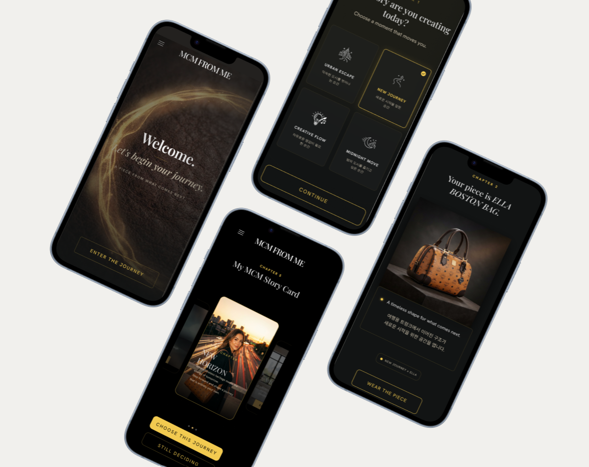

# mcm_from_me
덕성여자대학교 멋쟁이사자처럼 4팀 mcmory

### 💡 프로젝트 소개

### 💡 서비스 소개

  MCM FROM ME는 고객의 실제 선택과 스타일링 행동을 AI가 해석해, MCM의 브랜드 스토리와 연결하는 인터랙티브 리테일 서비스입니다.
  매장에서 제품을 착용하고 스트랩·참·착용 방식을 선택하는 과정은 AI를 통해 하나의 개인화된 이야기로 이어지고, 그 결과 고객만의 이미지와 Journey Card로 완성됩니다. 단순히 제품을 확인하는 순간을 넘어, 고객이 직접 MCM의 이야기를 만들어가는 새로운 브랜드 경험을 제안합니다.

### 💡 기술 스택

  프론트엔드:    

  백엔드:  

  기획·디자인:    

### 💡 팀원 소개

<table border="" cellspacing="0" cellpadding="0" width="100%">
<tr width="100%">
<td align="center">박채희</td>
<td align="center">박주현</td>
<td align="center">이주희</td>
<td align="center">이정은</td>
<td align="center">천유진</td>
</tr>

<tr width="100%">
<td align="center">기획·디자인</td>
<td align="center">프론트엔드</td>
<td align="center">프론트엔드</td>
<td align="center">백엔드</td>
<td align="center">백엔드</td>
</tr>

<tr width="100%" color="white">
<td align="center">@chaehui0918</td>
<td align="center">@wngus0328</td>
<td align="center">@jooeeeh17</td>
<td align="center">@abdc5307</td>
<td align="center">@yulmoo75</td>
</tr>
</table>

### 🎬 서비스 시연 및 체험하기

서비스 시연 시 스마트폰 카메라로 아래 QR 코드를 스캔해서 실제 제품으로 서비스 화면을 직접 체험해 보세요!

  
   
   
  <em>👆 서비스 내 카메라로 스캔해 보세요!</em>

